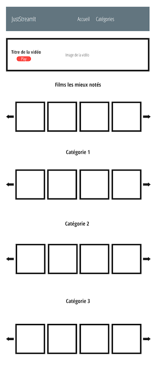

# [OpenClassRoom](https://openclassrooms.com/) - Parcours développeur Python

## Projet 6 - Développer une interface utilisateur pour une application web Python

### Description projet
Interagir avec une API REST. Développer la partie Front-End d’une application avec HTML, CSS et JavaScript.

### Exigences
- [x] Reproduire cette vue

- [x] Utiliser des requetes Ajax pour requeter l'API fournie et récupérer les données. Javascript pur, Axios, Fetch à intégrer.
- [x] L’interface doit comprendre les zones suivantes: “Meilleur film”, “Films les mieux notés et 3 catégories de films au choix
- [x] Le site doit fonctionner de façon similaire sur les trois navigateurs les plus utilisés actuellement.
---

## Comment utiliser le projet ?
1. Clone the repository

      `git clone --recursive https://github.com/memphis-tools/oc_projet6_juststreamit.git`

      `cd oc_projet6_juststreamit`

2. Setup a virtualenv

      `python -m venv env`

      `source env/bin/activate`

      `pip install -U pip`

      `pip install -r requirements.txt`
      
3. Prepare the local API and expose it

      `cd OCMovies-API-EN-FR`
      
      `python manage.py create_db`

      `python manage.py runserver`

4. Ouvrir la page index.html dans votre navigateur

